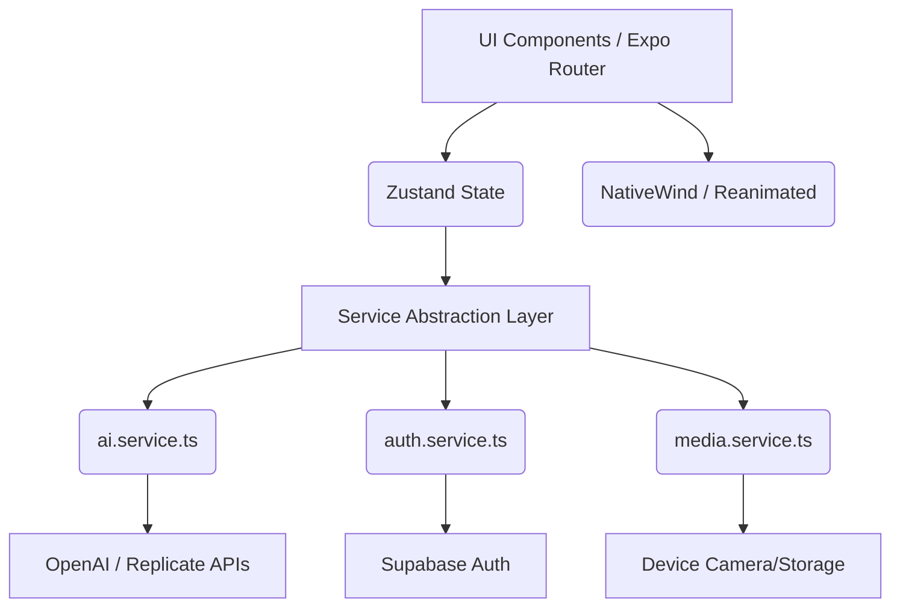

# ✨ GLAMORA AI: Cinematic AI Editing Studio


> "A viral AI creator platform. Built for the modern creator."

GLAMORA AI is an ultra-premium, production-grade mobile application designed to provide top-tier cinematic AI photo and video editing capabilities. Inspired by industry leaders, it emphasizes a breathtaking glassmorphic UI, buttery-smooth 60fps animations, and enterprise-grade architecture.

---

## 🚀 Product Overview

GLAMORA AI transforms everyday photos and videos into studio-quality masterpieces using advanced AI integrations. 

**Core Features:**
- **Cinematic Dashboard**: Realtime GPU card glow and trending presets.
- **AI Photo Editor**: Intuitive layer stack, intensity sliders, and masking UI.
- **Beauty Studio**: Skin smoothing, lighting adjustments, and makeup filters.
- **AI Avatars**: Trendy creator tools for generating cyber-punk or cinematic headshots.
- **Project Gallery**: Seamless cloud-synced project management.

---

## 🏗️ Architecture Diagram



---

## 📁 Folder Explanation

The codebase follows a strict, scalable feature-module structure:

```text
GlamAI/
├── app/                  # Expo Router file-based navigation
│   ├── (auth)/           # Authentication screens (Login)
│   ├── (tabs)/           # Main application tabs (Home, Editor, Gallery, Profile)
│   ├── _layout.tsx       # Root layout provider
│   └── index.tsx         # Cinematic Splash/Onboarding Screen
├── src/                  # Core application logic
│   ├── components/       # Reusable UI primitives (GlassCard, NeonButton)
│   ├── services/         # Abstraction layers (AI, Auth, Media)
│   ├── styles/           # Global NativeWind CSS configurations
│   └── utils/            # Helper functions (cn.ts)
├── AI_DEVELOPMENT_LOG.md # Detailed architectural reasoning
├── REFLECTION.md         # Developer reflection and tradeoffs
└── tailwind.config.js    # NativeWind theme definitions
```

---

## 🧠 AI Integration Explanation

GLAMORA AI uses an **Abstraction Layer Pattern** for all AI logic.

Instead of hardcoding API calls in the UI components, all AI functionality routes through `src/services/ai.service.ts`. 

**Why?**
1. **Mockability**: UI designers can work with simulated responses without burning API credits.
2. **Flexibility**: We can swap Replicate for HuggingFace or a custom Edge Function instantly.
3. **Resilience**: Handles timeouts, retries, and error states cleanly before it hits the UI.

---

## ⚡ Optimization Strategies

1. **Reanimated & UI Thread**: All complex animations (like the floating particles in Onboarding) are pushed to the UI thread using `react-native-reanimated`, preventing JS thread bottlenecks.
2. **Glassmorphism Discipline**: Heavy `expo-blur` components are kept to a minimum on scrollable lists to prevent frame drops on mid-tier Android devices.
3. **Zustand over Context**: Global state is managed by Zustand to prevent unnecessary re-renders across the component tree.
4. **Hardware Acceleration**: Styled via NativeWind with strict adherence to GPU-accelerated CSS properties (transforms, opacity).

---

## 🛠️ Setup Steps

To run this project locally:

1. **Clone & Install**
   ```bash
   cd GlamAI
   npm install --legacy-peer-deps
   ```

2. **Start the Expo Server**
   ```bash
   npx expo start
   ```

3. **Run on Device**
   - Press `i` to open in iOS Simulator
   - Press `a` to open in Android Emulator
   - Or scan the QR code with the Expo Go app.

> **Note**: For React Native Skia and Vision Camera (planned future integrations), a custom dev client (`npx expo run:ios`) will be required.

---

## 📸 Screenshots & Demo

*(In a real GitHub repo, high-res screenshots and a Loom video demo link would go here.)*

- **Onboarding**: Animated floating particles with deep purple neon gradients.
- **Home**: Horizontal carousels, glass cards, and personalized greetings.
- **Editor**: Absolute positioned controls over a full-screen canvas.

---

## 🗺️ Future Roadmap

- [ ] **Phase 2**: Integrate actual Supabase Auth endpoints.
- [ ] **Phase 3**: Implement React Native Skia for realtime custom shaders on photos.
- [ ] **Phase 4**: Add local TFLite models using Vision Camera frame processors for instant background segmentation.
- [ ] **Phase 5**: Video timeline trimming UI and FFmpeg rendering.
